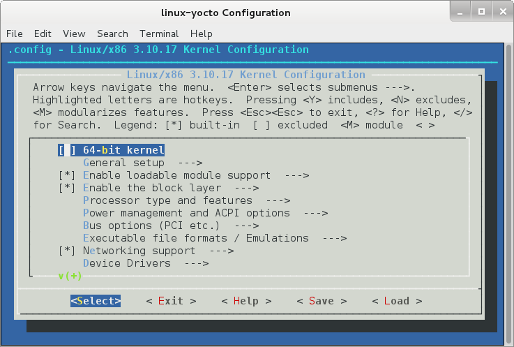
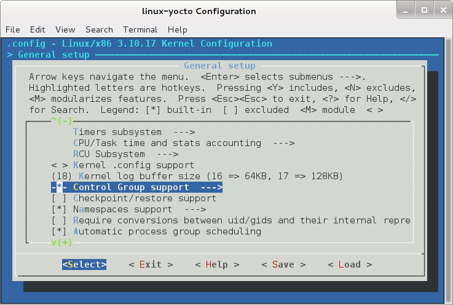
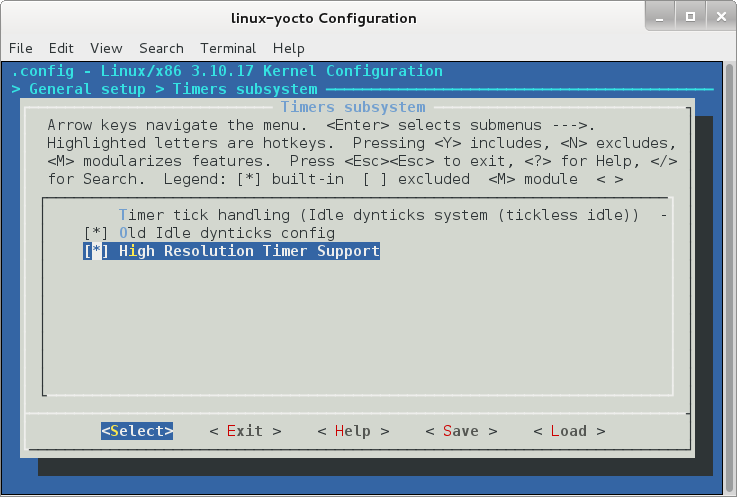
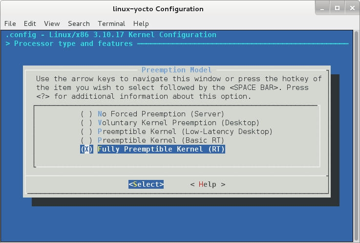
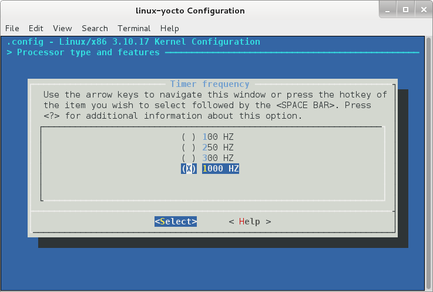
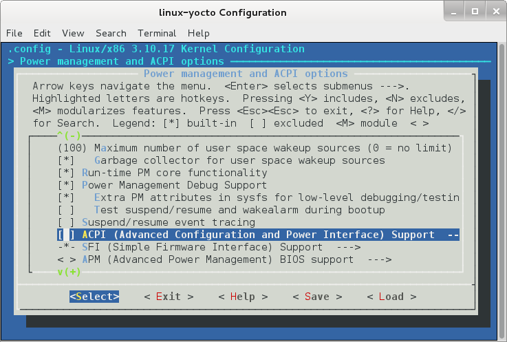
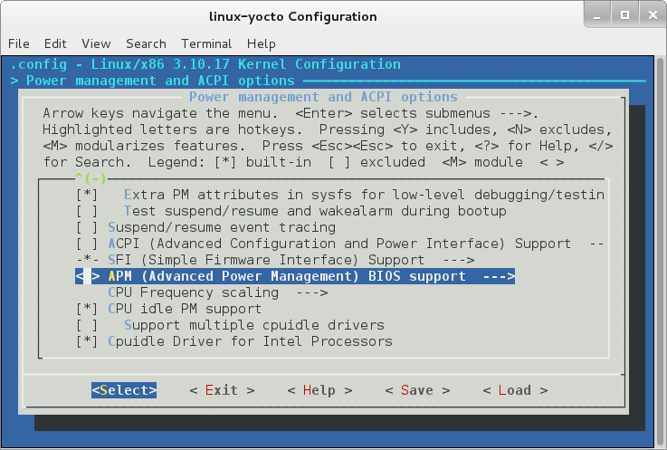
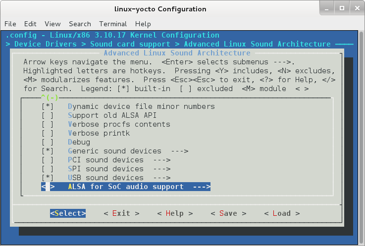
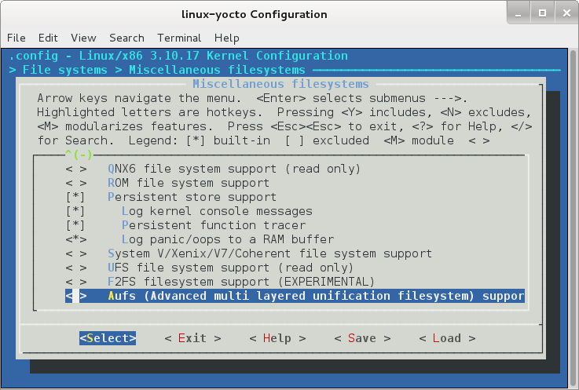
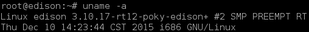

Installation
==

First, extract the contents of the edison-src-rel1-maint-rel1-ww42-14.tgz file you just downloaded and change directory to the one just extracted

Version ww42-14

    $ tar -xzf edison-src-rel1-maint-rel1-ww42-14.tgz
    $ ls edison-src
    arduino  broadcom_cws  device-software  mw
    $ cd edison-src

Version ww24-15

    $ tar xvf edison-src-ww25.5-15.tgz
    $ ls edison-src
    Makefile  meta-intel-edison
    $ cd edison-src

Connect two USB cables to the Edison board and to the computer where the commands are executing, move the switch next to the microUSBs slots towards the microUSBs.

Use the setup.sh script that is inside the folder *meta-intel-edison*. This script initializes the build environment for Edison. Type

    $ ./meta-intel-edison/setup.sh

to run it. Optionally, we can move our download and build cache (also known as sstate) directories under the build directory. Moving these two directories will make it easier to share data between build environments and allow much faster rebuilding images

    $ ./meta-intel-edison/setup.sh --dl_dir=/path/bitbake_download_dir --sstate_dir=/path/bitbake_sstate_dir```  .

Then, change directory to poky, see its content

    $ cd out/linux64/
    $ ls 
    build  poky

and configure the shell environment with the following source command

    $ source poky/oe-init-build-env
    ### Shell environment set up for builds. ###

    You can now run 'bitbake <target>'

    Common targets are:
        core-image-minimal
        core-image-sato
        meta-toolchain
        adt-installer
        meta-ide-support
    
    You can also run generated qemu images with a command like 'runqemu qemux86'

Now, we are ready to build a full Edison image with the following bitbake command
    
    $ bitbake edison-image
    Loading cache: 100% |###################################################################################################| ETA:  00:00:00
    Loaded 1365 entries from dependency cache.
    NOTE: Resolving any missing task queue dependencies
    
    Build Configuration:
    BB_VERSION        = "1.24.0"
    BUILD_SYS         = "x86_64-linux"
    ... ...
    NOTE: Tasks Summary: Attempted 3757 tasks of which 568 didn't need to be rerun and all succeeded.

    Summary: There were 26 WARNING messages shown.

It is important to build a full image for the first time before making any changes to the Edison image. Be patient, this process takes from 2 to 5 or more hours depending on the hardware of the host machine.

After successfully building the edison-image, run the postBuild script with the following command 

    $ ../meta-intel-edison/utils/flash/postBuild.sh .

Now, let's return to our set up root folder

    $ cd ../../../edison-src/

Create a directory called Patches and then switch to it

    $ mkdir Patches
    $ cd Patches

and use wget to download the Real Time patches

    $ wget http://yoneken.sakura.ne.jp/share/rt_edison.tar.bz2

Decompress the bz2 file

    $ tar -xaf rt_edison.tar.bz2

and move these two patches called *patch-3.10.17-rt12_edison.patch* and *intel_mid_rpmsg.c.patch* to the files directory where new patches are placed

    $ cp patch-3.10.17-rt12_edison.patch /meta-intel-edison/meta-intel-edison-bsp/recipes-kernel/linux/files/
    $ cp intel_mid_rpmsg.c.patch /meta-intel-edison/meta-intel-edison-bsp/recipes-kernel/linux/files/

Now, let's edit a file under the Linux directory, one directory above the files directory we've just copied the Real Time patches. Move to the Linux directory

    $ cd meta-intel-edison/meta-intel-edison-bsp/recipes-kernel/linux/

and edit de bbappend file (assuming the edition happens under a Debian based Linux distribution; otherwise use a simple text editor like nano, vi, vim or emacs)

    $ gedit linux-yocto_3.10.bbappend
    
Replace the content of the file to have the following:

    FILESEXTRAPATHS_prepend := "${THISDIR}/files:"  
    COMPATIBLE_MACHINE = "edison"  
    LINUX_VERSION = "3.10.17"  
    SRCREV_machine = "c03195ed6e3066494e3fb4be69154a57066e845b"  
    SRCREV_meta = "6ad20f049abd52b515a8e0a4664861cfd331f684"  
      
    SRC_URI += "file://defconfig"  
    SRC_URI += "file://upstream_to_edison.patch"  
    SRC_URI += "file://patch-3.10.17-rt12_edison.patch"  
    SRC_URI += "file://intel_mid_rpmsg.c.patch"  
    do_configure() {  
      cp "${WORKDIR}/defconfig" "${B}/.config"  
    }  
    do_kernel_configme() {  
      cp "${WORKDIR}/defconfig" "${B}/.config"  
    }  
    do_patch() {  
      cd ${S}  
      git am "${WORKDIR}/upstream_to_edison.patch"  
      git apply "${WORKDIR}/patch-3.10.17-rt12_edison.patch"  
      git apply "${WORKDIR}/intel_mid_rpmsg.c.patch"  
    }


Now, move to our edison root folder

    $ cd ~/edison-src/

configure the shell environment again

    $ source poky/oe-init-build-env

and get into the Kernel Configuration

    $ bitbake virtual/kernel -c menuconfig


When first run, you will be prompted with a screen like this

 

Enable *Control Group Support* under General setup settings

  

Enable *High Resolution Timer Support* under General setup -> Timer subsystem settings

 

Enable *Fully Preemptible Kernel (RT)* under Processor type and features settings

 

Enable Timer frequency to *1000 HZ* under Processor type and features -> Timer frequency settings

 

Disable *ACPI (Advanced Configuration and Power Interface)* under Power management and ACPI options settings

 

Disable *APM (Advanced Power Management) BIOS support* under  settings

 

Disable *ALSA for SoC audio support* under Device Drivers -> Sound card support -> Advanced Linux Sound Architecture -> ALSA for SoC audio support settings

 

Disable *Aufs (Advanced multi layered unification filesystem) support* under File systems -> Miscellaneous filesystem -> Aufs (Advanced multi layered unification filesystem) support settings

 

Save the configuration and exit Kernel Configuration.

When the Kernel configuration is complete, change directory to linux-edison-standard-build folder

    $ cd tmp/work/edison-poky-linux/linux-yocto/3.10.17+gitAUTOINC+6ad20f049a_c03195ed6e-r0/linux-edison-standard-build/

and copy the Kernel configuration to these two folders

    $ cp .config ~/intel-edison-system-setup-files/device-software/meta-edison/recipes-kernel/linux/files/defconfig
    $ cp .config ../linux/arch/x86/configs/i386_edison_defconfig

Go back to our edison-src root folder

    $ cd ~/edison-src

and configure the shell environment again

    $ source poky/oe-init-build-env

Force bitbake to copy the modified configuration to the actual build directory

    $ bitbake virtual/kernel -c configure -f -v

now our image is ready to be built
    
    $ bitbake edison-image

The whole Edison image is rebuilt using the Real Time patched Kernel.

Now, we have to run a post building script, located in another folder. Change directory to

    $ cd ../../../meta-intel-edison/utils/

and run
    
    $ ./postBuild.sh

to prepare our new setup for the flashing process. Change directory to the flash folder

    $ cd flash/

and execute the flash script with sudo privileges

    $ sudo ./flashall.sh 

Finished the flashing process, get into de Edison system

    $ sudo screen /dev/ttyUSB0 115200

hit enter a few times and a log in appears. Default user is *root* with no password.

Once logged in run ```uname -a```, the name of the Kernel should have been renamed with the RT tags as shown below.


